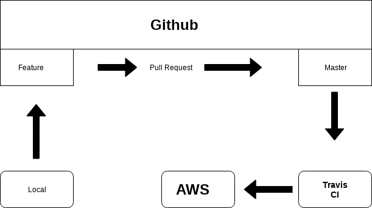
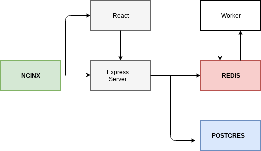

# aws-workflow

React.js + Node.js + Docker + Travis CI + AWS

## Development

- **Worker**: calculates new values
- **Server**: gets API requests
- **Postgres**: keeps tracking on indexes
- **Redis**: store values
- **React**: front end and UI

